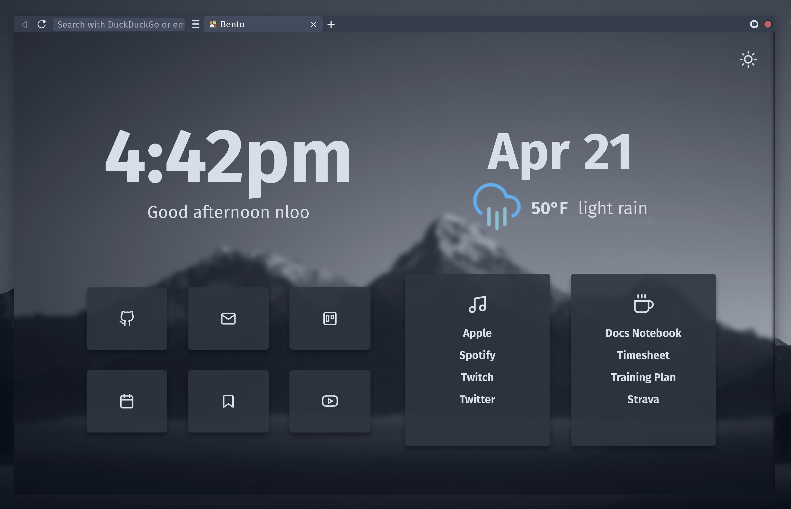

# nlooStartpage

This is the startpage I use which I forked from: [Bento](https://github.com/migueravila/Bento).

I've added some customizations to fit my setup better and currently it is made to go with my gruvbox styled [Firefox CSS theme](https://github.com/n-loo/nlooFirefoxCSS).

Right now I'm using a custom gruvbox [Firefox Color theme](https://color.firefox.com/?theme=XQAAAAIYAgAAAAAAAABBqYhm849SCicxcUBMsXcGHf3p79EhVPcztfddumy8o_UrWNUWc0S9J4RWZg9SMeuYZaJT88pn7xa_rvNukG5H1hFGi74wErG9RUT13h1zOpfl5PwzOO2SPS8raQiDG5dhwmkrc21HIP5VgIya5cSlN0_0jaTcQTRJM6m5Ti5u-wrBZj8Jj4tx6WWZleYo0frh9e3nG7tupQFIYrhWM1n_zV_6O0uWrKnj7xU4pUZYl3ORjbzu3hiQSC0TAIBrenLEO5IcbenBtXL9gzm85tyzTNh4yJaAsqynYulZVfwWB68YjIdwlM3P-Ty-lWGLMIVdCg4TTytXiKuP8e09j02zWA017_w2Oqzz3mTsM6oo9rMEbJkUSV75hr4C)

Here is a preview!

This startpage requires the [open sans font](https://fonts.google.com/specimen/Fira+Sans).
